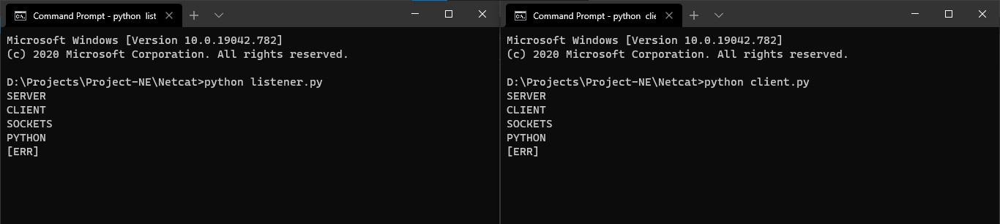

# Netcat-Sockets

Netcat Server/Client Chat Application

### HOW TO RUN?
    I have tested this program in Windows 10 Enterprise.

-----------------------------------
###       W I N D O W S
-----------------------------------
- open command prompt
- navigate to  file path
- type the following command
>python listener.py "serverFILE"  
>python client.py "clientFILE"  
-----------------------------------
###         L I N U X
-----------------------------------
- open Terminal
- navigate to  file path
- type the following command
>python3 listener.py <port number>  
>python3 client.py <Ip Addres> <port number>  

### The OUTPUT of the PROGRAM

